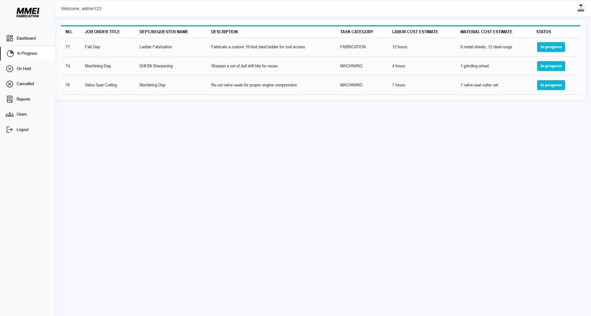

# 📋 Job Order Management

Welcome to the **Job Order Management System**, a streamlined solution designed to help businesses efficiently track, manage, and process job orders from inception to completion.

## 🛠️ Technology Stack

### Frontend

- **HTML**: The standard language for creating the structure of web pages.  
- **CSS**: Used to style and design HTML elements with colors, layouts, fonts, etc.  
- **JavaScript**: A programming language that runs in the browser to make web pages interactive.  
- **Bootstrap**: A front-end CSS framework that makes it easy to design responsive and mobile-first websites quickly.

### Backend

- **php**: A server-side scripting language used to build dynamic web applications.
- **mysql**: Stores all application data, such as user accounts, job orders, inventory, etc.
- **xampp**: Ideal for running and testing your PHP-MySQL app on localhost before deployment.
- **Composer**: Useful for installing and managing libraries/packages


## 🚀 Features

### 🔐 Authentication
- Login and Signup functionality  
- Google reCAPTCHA protection  
- Google Authentication (OAuth)  
- Forgot Password functionality (Email-based reset)

### 👤 User Panel
- Personalized Dashboard  
- Job Order Request Form  
- Track status of submitted job orders  
- View completed job orders

### 🛠️ Admin Panel
- Approve or deny job order requests  
- Track and manage job order statuses  
- Sidebar modules dynamically change based on job order status  
- Download completed job orders as PDF

## Installation 
### 📁 1. Clone or Download

- Download the ZIP or clone the repository:
- Move the project folder into your XAMPP `htdocs` directory:
  ```
  C:/xampp/htdocs/
  ```

### ⚙️ 2. Install Dependencies

```bash
PHP dotenv - For storing credentials and secret keys
PHPMailer - For sending email notifications and confirmations
Google API Client - For Google authentication and API integration
mPDF - For generating PDF documents and reports
```

### 🔐 3. Create `.env` File

In the root of your project, create a `.env` file and add the following:

```env
SITE_KEY=your_site_key
SECRET_KEY=your_secret_key
GOOGLE_CLIENT_ID=your_google_client_id
GOOGLE_CLIENT_SECRET=your_google_secret_key
GOOGLE_REDIRECT=http://localhost/[your-project]/google-auth/google-callback.php
```

### 🗄️ 4. Create MySQL Database

Create a database (e.g., `booking_system`) and use the SQL below to set up tables:

#### 🧍 users Table

```sql
CREATE TABLE `users` (
  `id` int(11) NOT NULL,
  `name` varchar(255) NOT NULL,
  `email` varchar(255) NOT NULL,
  `password` varchar(255) NOT NULL,
  `role` enum('user','admin') NOT NULL,
  `reset_code` bigint(20) DEFAULT NULL
);
```

#### 📋 job_orders Table

```sql
CREATE TABLE `job_orders` (
  `id` int(11) NOT NULL,
  `user_id` int(11) NOT NULL,
  `title` varchar(255) NOT NULL,
  `description` text DEFAULT NULL,
  `service_type` enum('MACHINING','FABRICATION') NOT NULL,
  `labor_cost` varchar(255) DEFAULT NULL,
  `material_cost` varchar(255) DEFAULT NULL,
  `urgency` enum('LOW','HIGH','URGENT') NOT NULL,
  `status` enum('pending','approved','rejected','in-progress','on-hold','canceled','complete') DEFAULT 'pending',
  `created_at` timestamp NOT NULL DEFAULT current_timestamp()
);
```

### ▶️ 5. Run the systen

- Open **XAMPP Control Panel**.
- Start **Apache** and **MySQL**.
- In your browser, go to:

```txt
http://localhost/[your-folder-name]
```

## DataBase Schema

The system uses MySQL/MariaDB with the following key tables:

## 👤 Users and Authentication
users – Stores user accounts and credentials

Fields: id, name, email, password, role, reset_code

Supports roles such as user and admin

## 🛠️ Job Order Management
job_orders – Contains job order submissions from users

Fields: id, user_id, title, description, service_type, labor_cost, material_cost, urgency, status, created_at

Tracks job order lifecycle with statuses like pending, in-progress, complete, etc.

Categorizes service types as MACHINING or FABRICATION

##


# 🧍 ScreenShots

 
 _Get Started_

 
 
 _Login Page_

 
 _Register Page_
 
 
 _forgot Password page_
 
 
 _admin dashboard_

  
 _admin inprogress_

 
 _admin cancel_

 
 _admin cancel_

  
 _admin users_

 
 _admin reports_

 
 _User Request form_

  
 _User Request form_
